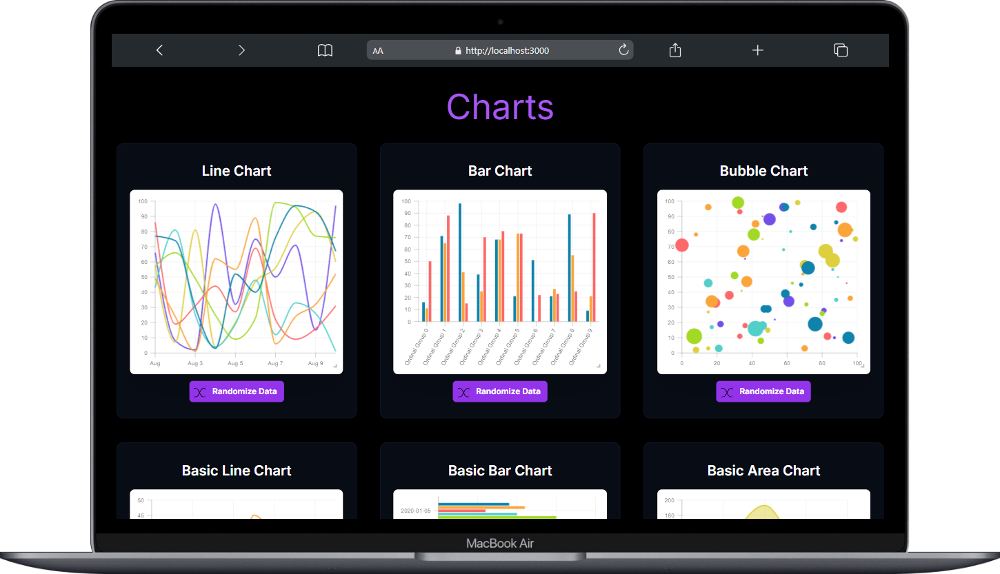
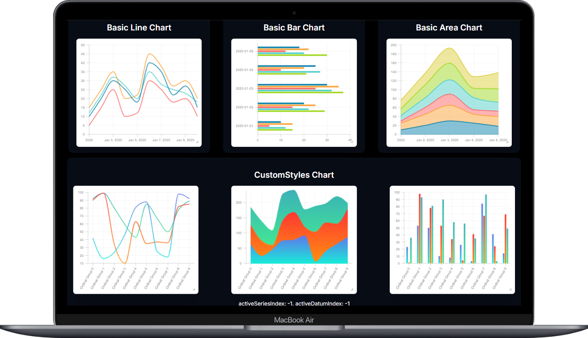

## [React Charts](https://react-charts.tanstack.com/ "Beautiful, flexible, highly-performant charts for React") Tanstack tarafından geliştirilen özelleştirilebilir grafikler oluşturmak için kullanılan bir React kütüphanesidir.

#### React Charts
- **Amaç:** React uygulamaları için grafik ve çizelge oluşturma.
- **_Özellikler:_**
  * **Çoklu Grafik Türleri:** Çizgi, bar, alan ve pasta grafikler gibi çeşitli grafik türlerini destekler.
  * **Yüksek Performans:** Büyük veri setlerini işleyebilir ve performanslı bir şekilde render eder.
  * **Esneklik ve Özelleştirme:** Eksenler, seriler, araç ipuçları ve diğer grafik bileşenlerini özelleştirme imkanı sunar.
  * **Etkileşimli Özellikler:** Kullanıcı etkileşimlerini (tıklama, hover, seçim vb.) destekler.
  * **Responsive Tasarım:** Mobil ve masaüstü cihazlarda sorunsuz çalışır.
  * **TypeScript Desteği:** TypeScript ile uyumludur ve tip güvenliğini sağlar.

 
React Charts'i yüklemek icin aşağıdaki npm komutunu yazabilirsiniz.
  

`
 npm install react-charts@beta --save
`

 

