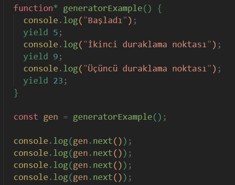

# Redux-Saga nedir? 

Redux-saga (Redux-Saga) kendi sitesinde yazdığı gibi *An intuitive Redux side effect manager* yani ***Sezgisel bir Redux yan etki yöneticisidir***. Burada sezgisel kelimesinin anlamı; bu araçların kullanımının anlaşılır ve kolay olduğunu belirtir. Sezgisel bir araç, geliştiricilerin öğrenmesi ve kullanması  kolay olan bir araçtır. Bu tür araçlar, karmaşık işlemleri basit ve anlaşılır bir şekilde yönetmenizi sağlar.  

Redux-Saga, Redux ile kullanılan bir kütüphanedir ve uygulamanızın yan etkilerini (örneğin, veri getirme, veri gönderme gibi asenkron işlemler) yönetmek için kullanılır. Redux Saga, JavaScript ES6 generator fonksiyonları ile yazılır ve middleware olarak Redux ile entegre edilir.

**Generator Fonksiyonlar** nelerdir hemen kısaca değinelim. Normal fonksiyonlar run-to completion (tamamlamak üzere çalış) modeli adında bir mekanizmayı takip ederler. Bir fonksiyonu çağırdığımızda tamamlanana kadar çalışır (tabii bir yerlerde hata almıyorsa). Öyle durup dururken rastgele bir yerlerde fonksiyonu durduramayız. ES6 ile gelen Generator fonksiyonlar ise bunun tam tersi run-to completion modeline uymazlar. Yani bir generator fonksiyonunu çağırdıktan sonra ortalarda bir yerde  durdurabiliriz. `function*` anahtar kelimesi kullanarak bir generator fonksiyonu oluştururuz.  
<code>
function* sayHello() { 
yield 'Hello'; 
yield 'World'; } </code>

Peki bu fonksiyonu nasıl durdurabiliriz? O da yield anahtar kelimesi ile. yield, bir generator fonksiyonunun çalışmasını duraklatır ve değeri dışarıya döndürür. Daha sonra, generator fonksiyonu yeniden başlatıldığında, kaldığı yerden devam eder.
* Generator fonksiyonları, diğer fonksiyonlardan farklı olarak değer döndürmek yerine bir iterator nesnesi döner ve bu nesne, ***next()*** metodu kullanılarak generator'un bir sonraki değeri hesaplamasına olanak tanır.
 
Küçük bir örnek:  
 

- Burada yield 5 olarak tanimladigimiz bizim value değerimiz oluyor. 
- Her adımda value ve done bilgisi yazildi ve yield’lar bittikten sonra 4.next’de artık değer kalmadığı için value undefined dönüyor ve beraberinde artık sonlandığı için done değeri true olarak bize veriliyor. 

***Konumuza geri dönelim ve Redux-Saga'nin temel özelliklerine değinelim.*** 
• Asenkron İşlemleri Yönetme: Redux Saga, asenkron işlemleri (API çağrıları, zamanlayıcılar, vb.) kolay ve düzenli bir şekilde yönetmenizi sağlar. Bu işlemleri yönetmek için call, put, takeLatest gibi efektleri kullanabilmenize olanak sağlar. 
• Kontrollü Akış: Saga'lar, generator fonksiyonları kullanarak işlemler arasında kontrol akışı sağlar. Bu sayede işlemler sırasıyla ve kontrollü bir şekilde yürütülür. 
• Uygulama Durumunu Yönetme: Redux Saga, uygulamanın durumunu yönetmek ve güncellemek  için Redux aksiyonlarını dinler ve bu aksiyonlara uygun işlemler gerçekleştirir.

***Redux saga içerisinde bulunan call, put, takeLatest nedir ve neden kullanılır?***
Redux-Saga, `call`, `put`, ve `takeLatest` gibi efektler kullanarak side effectleri yönetir. Bu effectler, generator fonksiyonları içinde yield ile kullanılarak belirli işlemleri gerçekleştirir.  

* **Call efekti:** Bir fonksiyonun çağrılmasını ve bu fonksiyonun sonucunun elde edilmesini sağlar. Genellikle asenkron işlemler (örneğin, API çağrıları) için kullanılır. call, fonksiyonun yürütülmesini bekler ve sonucu döndürür. <code>const user = yield call(axios.get, `https://jsonplaceholder.typicode.com/users/${action.payload.userId}`)</code>  
* **Put efekti:** Redux store'a bir aksiyon dispatch etmek için kullanılır. Bu, saga'nın 
tamamlanmasından sonra Redux state'ini güncellemek için kullanılır. <code>yield put({ type: "USER_FETCH_FAILED", message: err.message }) </code>  
* **takeLatest efekti:** Belirtilen aksiyon türüne sahip en son başlatılan işlemi izler ve sadece en son başlatılan işlemi yürütür. Önceki işlemler iptal edilir. 
<code>yield takeLatest("USER_FETCH_REQUESTED", fetchUser) </code>

 

> Bunları artık öğrendiğimize göre basit bir react uygulaması oluşturarak kod üzerinde görelim.

 

* Öncelikle `npm create vite` komutu ile react projemizi oluşturalım 
* Daha sonra gerekli olan paketleri yükleyelim
``npm install @reduxjs/toolkit react-redux redux-saga axios``  
* Bunları yükledikten sonra `npm run dev` komutu ile projemizi ayağa kaldıralım. Klasörlerin içerisindeki tüm gereksiz kodları temizledikten sonra src altında components ve redux klasörümüzü oluşturalım.  
* Redux klasörünün içerisinde 2 adet klasör daha oluşturalım. Bunlardan bir tanesi reducerimizin olduğu diğeri ise sagalarimiz bulunduğu klasör olacak. Bir de bunlardan ayrı olarak store'umuzu tanımlayacağız. En sonunda klasör yapımız aşağıdaki fotoğraftaki gibi görünecek.  

 

### Genel Özet 

• **Redux Store:** redux/store.js dosyasında oluşturur ve saga middleware'imizi ekliyoruz. 
• **Reducer:** redux/reducers/userReducer.js dosyasında kullanıcı verilerini yöneten bir reducer tanımlıyoruz. 
• **Saga:** redux/sagas/userSaga.js dosyasında kullanıcı verilerini çeken bir saga tanımlanıyoruz. 
• **Bileşenler:** components/UserDisplay.jsx ve components/ErrorDisplay.jsx dosyalarında kullanıcı bilgilerini ve hata mesajlarını gösteren bileşenler tanımlanıyoruz.  
• **Ana Bileşen:** App.jsx dosyasında ana uygulama bileşeni tanımlıyoruz. Bu bileşen, kullanıcı verilerini çekmek için bir buton sağlıyor ve kullanıcı bilgilerini, hata mesajlarını ve yükleme durumunu kullanıcıya gösteriyoruz.