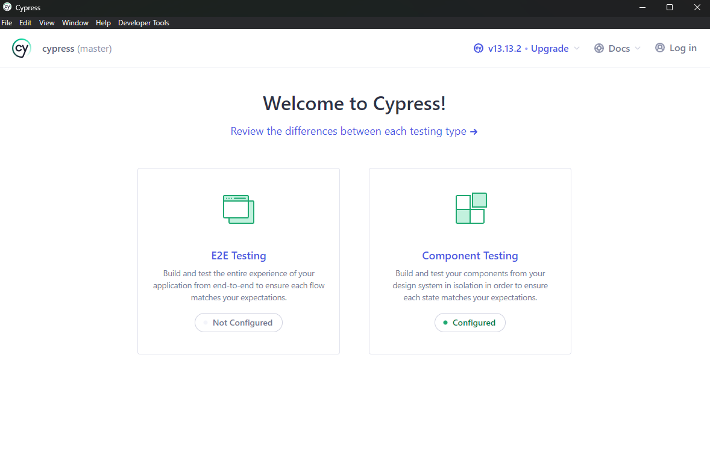
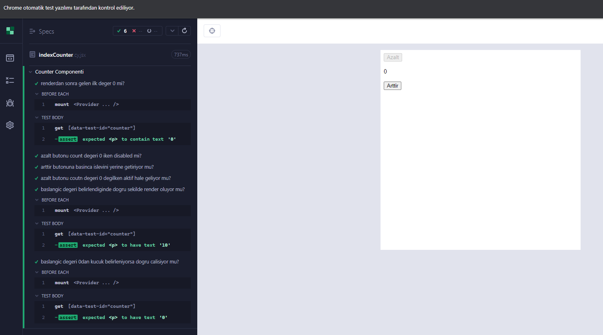

## [Cypress](https://www.cypress.io// "Test. Automate. Accelerate.") 2014 yılında Brian Mann tarafından oluşturulmuş ve Cypress.io tarafından geliştirilmiştir.

#### Cypress
- **Amaç:** Modern web uygulamalarını test etmek için kullanılan popüler bir test aracıdır. Cypress, geliştiricilerin ve QA mühendislerinin, JavaScript tabanlı web uygulamalarını hızlı ve kolay bir şekilde test edebilmeleri için tasarlanmıştır.
- **_Özellikler:_**
  * **Hızlı ve Güvenilir Testler:** Tarayıcıya doğrudan entegre olması sayesinde, testler hızlı ve güvenilir sonuçlar verir.
  * **Gerçek Zamanlı Yenileme:** Testlerin anlık sonuçlarını görerek kodunuzu hızlıca düzeltebilirsiniz.
  * **Zengin Test Yazma Deneyimi:** Güçlü ve anlaşılır API'si ile test yazımı kolaydır; kullanıcı etkileşimlerini simüle eder.
  * **Yerel Destek:** React, Vue, Angular gibi modern framework'lerle sorunsuz çalışır.
  * **Otomatik Bekleme:** Elementlerin yüklenmesini ve etkileşime hazır hale gelmesini otomatik olarak bekler.
  * **Detaylı Hata Ayıklama:** Tarayıcıda detaylı hata ayıklama (debugging) yapma imkanı sunar.
  * **E2E ve Entegrasyon Testleri:** Uçtan uca testler ve gerçek kullanıcı deneyimini simüle eder.
  * **Zaman Yolculuğu:** Testlerin her adımında zaman yolculuğu yaparak detayları inceleyebilirsiniz.

 

### Cypress ile E2E ve Component testi yapabiliyoruz. Peki nedir bu kavramlar?
**_E2E (End-to-End) Testleri_**
 * **Amacı:** E2E testleri, bir uygulamanın tüm işlevselliğini baştan sona, gerçek kullanıcı etkileşimleriyle test eder. Bu testler uygulamanın tüm bileşenlerinin (frontend, backend, veri tabanı, API) birlikte çalıştığını doğrular.
 * **Özellikleri:**
    - Uygulamanın tüm akışını, baştan sona kullanıcı perspektifinden test eder.
    - Tarayıcıda çalışır ve gerçek kullanıcı etkileşimlerini (tıklamalar, form doldurma, sayfa geçişleri vb.) simüle eder.
    - Kullanıcı deneyimini test eder, yani bir butona tıkladıktan sonra doğru sayfaya yönlendirildiğinizi veya doğru işlemin gerçekleştiğini kontrol eder.
* **Örnek Senaryolar:**
  - Kullanıcı giriş yapar, bir ürün arar, sepete ekler ve ödeme yapar.
  - Kullanıcı form doldurur ve doğrulama hatalarıyla nasıl başa çıkıldığını görür.

**_Component Testleri_**
 * **Amacı:** Component testleri, uygulamanın tekil bileşenlerinin izole bir şekilde doğru çalışıp çalışmadığını test eder. Bileşenlerin bağımsız olarak işlevselliğini ve kullanıcı etkileşimlerini kontrol eder.
 * **Özellikleri:**
    - İzole edilmiş ortamda, diğer bileşenlerden bağımsız olarak bir komponenti test eder.
    - Komponentin doğru şekilde render edilip edilmediğini, verilen props veya durumlara (state) göre doğru tepkiler verip vermediğini kontrol eder.
    - Componentin UI ve davranışını test eder, yani tıklamalar, metin girişleri gibi etkileşimleri simüle eder.
 * **Örnek Senaryolar:**
   - Bir düğmenin doğru şekilde render edilip tıklamaya yanıt verip vermediğini test etmek.
   - Form bileşeninin hatalı girişlerde doğru hata mesajlarını gösterip göstermediğini kontrol etmek.
  

#### Aralarindaki en temel fark kapsadiklari test sekli:
- E2E Testleri: Uygulamanın tüm akışını kapsar, sistemin tüm bileşenlerinin birlikte nasıl çalıştığını kontrol eder.
- Component Testleri: Belirli bir bileşeni izole bir şekilde test eder, bileşenin tek başına nasıl çalıştığını kontrol eder.

 
Cypress'i yüklemek icin aşağıdaki npm komutunu yazabilirsiniz.
  

`
    npm install cypress --save-dev
`

 

##### Cypress test yapma şeklinizi belirlemenizi sağlar

 

##### Basit bir counter sayaci ile component testi

